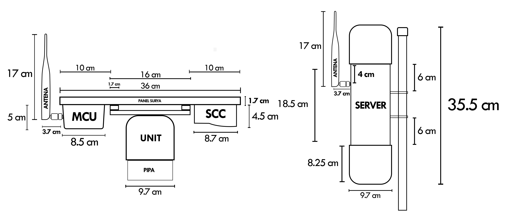
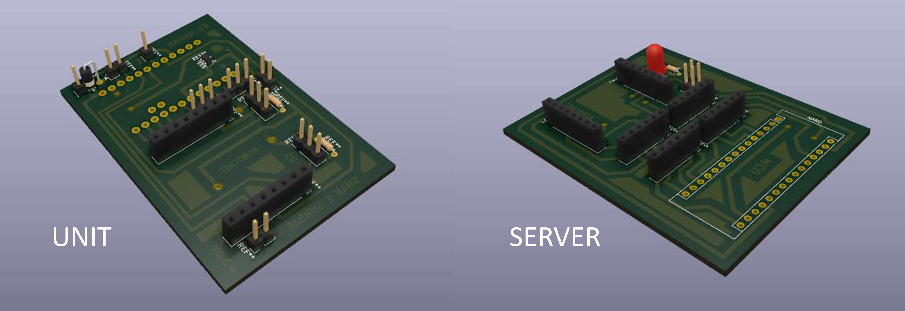
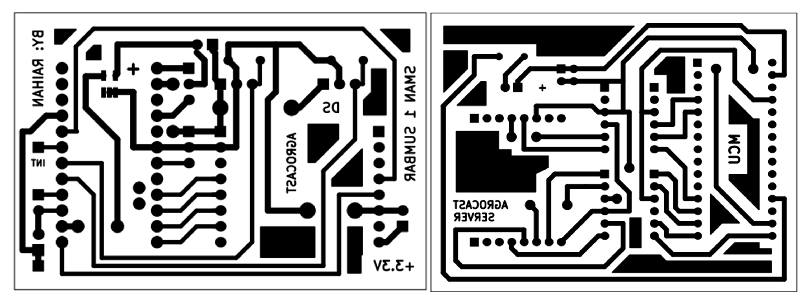
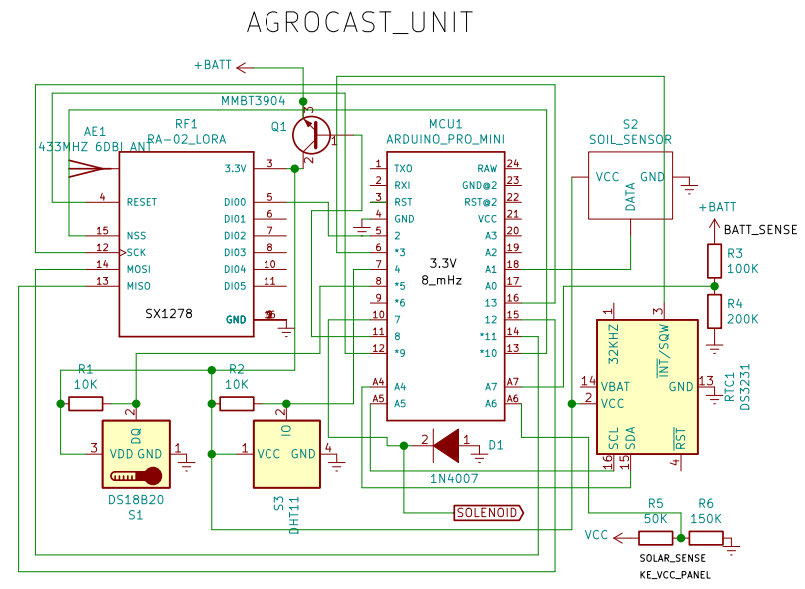
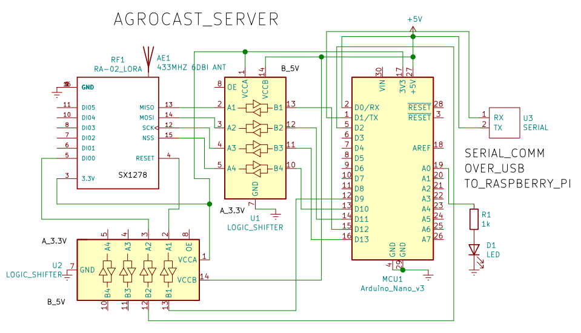

### AGROCAST: Automatic Irrigation based on OpenWeatherMap Forecast Data, Long-Range (LoRa), and Internet of Things

Agrocast is an innovative smart irrigation system designed to automate and optimize farmland irrigation processes. Leveraging the power of the Internet of Things (IoT), Agrocast intelligently monitors weather forecasts from the web, ensuring efficient water usage. By integrating solar panels for energy sustainability and employing ultra-low power technology, Agrocast operates autonomously, reducing the need for human intervention. The system abstains from irrigation when rain is predicted, further conserving water resources. Agrocast's real-time irrigation data is seamlessly transmitted to the ThingSpeak website, providing farmers with convenient and insightful monitoring capabilities. This open-source project aims to enhance agricultural practices by combining automation, sustainability, and data-driven insights for precision irrigation management.

Agrocast comprises two essential components: the server and irrigation controllers, establishing a scalable and efficient smart irrigation network. Each server has the capability to oversee multiple irrigation controllers, enhancing the system's adaptability for various farmland sizes. The irrigation controller manages the opening and closing of the irrigation pipes, ensuring precise control over the irrigation process. On the server side, comprehensive irrigation data logging takes place, providing valuable insights for analysis and optimization. Additionally, the server actively communicates with forecast websites to retrieve real-time rain predictions, facilitating intelligent decision-making for water conservation. The seamless and energy-efficient communication between the server and irrigation controllers is achieved through LoRa (Long Range) technology, ensuring reliable connectivity and enabling Agrocast to operate as a cohesive and synchronized smart irrigation solution.

### PCB Design

Image above shows the 3D design of the PCB made in KiCAD EDA. The system is composed of two parts. The first one is the server side, which mainly controlled by a Raspberry Pi 3. The server's role is to gather information regarding the local weather and send irrigation instruction to clients side through LoRa. The server will time the irrigation and send irrigation instruction in accordance of the local weather forecast. If rain is detected, irrigation will not be initiated, in order to save water and create sustainability.

### Documentations

